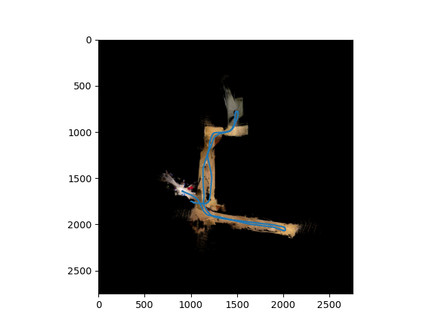

# Particle Filter LiDAR SLAM

# Overview
This project uses IMU data and LiDAR observations to estimate where our agent is and create a 2D map of its environment. This utilizes the Particle Filter with LiDAR and IMU data to estimate the 2D pose of an agent and create a 2D occupancy grid map.

# Implementation
This was implemented in Python using NumPy and Numba. The code has been redacted, if you wish to see it, you may contact me at charles.lychee@gmail.com

# Results
## Dataset 1
[](https://www.youtube.com/watch?v=4h5Riopciw4)




## Dataset 2
[](https://www.youtube.com/watch?v=2y03yO7TFj4)


# Mathematical Approach
## Variables
### State
```math
\mathbf{x} = \begin{pmatrix}
    x \\
    y \\
    \theta \\
\end{pmatrix} = \begin{pmatrix}
    \text{x-position} \\
    \text{y-position} \\
    \text{rotation}
\end{pmatrix}
```

```math
\text{2D Occupancy Grid Map}: \mathbf{m}_t
```

```math
\text{Motion Error}: \mathbf{w}_t
```

### Control
```math
\mathbf{u} = \begin{pmatrix}
    v \\
    \omega
\end{pmatrix} = \begin{pmatrix}
    \text{linear velocity} \\
    \text{angular velocity}
\end{pmatrix}
```

### Observation
```math
\text{2D LiDAR Points}: \mathbf{z}_t
```
```math
\text{Measurement Error}: \mathbf{v}_t
```

## Models
### Kinematics/Motion Model
We make the assumption that this is a differential-drive robot.
```math
\begin{split}
\mathbf{x}_{t+1} &= f(\mathbf{x}_t, \mathbf{u}_t, \mathbf{m}_t, \mathbf{w}_t) \sim p_f(\cdot|\mathbf{x}_t, \mathbf{m}_t, \mathbf{u}_t) \\
&= \mathbf{x}_t + \tau_t \begin{pmatrix}
v_t \cos \theta_t \\
v_t \sin \theta_t \\
\omega_t
\end{pmatrix} + \epsilon(\mathbf{w}_t)
\end{split}
```

### Observation/Measurement Model
```math
\textbf{z}_t = h(\textbf{x}_t, \textbf{m}_t, \textbf{v}_t) \sim p_h(\cdot | \textbf{x}_t, \textbf{m}_t)
```

```math
p_h(\cdot | \textbf{x}_t, \textbf{m}_t) \propto \text{corr}(r(\mathbf{z}, \mathbf{x}), \mathbf{m})
```

Where $\text{corr}(r(\mathbf{z}, \mathbf{x}), \mathbf{m})$ is defined as the number of points from the LiDAR scan that corresponds to the given map environment. More precisely,

```math
\begin{split}
    \text{corr}(\mathbf{y}, \mathbf{m}) &= \sum_i \mathbbm{1}\{y_i = m_i\}\\
    \mathbbm{1}\{y_i = m_i\} &= \begin{cases}
        1, & \text{if } y_i = m_i\\
        0, & \text{else}
    \end{cases}
\end{split}
```

Where $\mathbf{y}$ is the transformation of LiDAR scan $z$ from LiDAR frame to the world frame using $\mathbf{x}$ then transformation from world frame to occupancy grid map cell units.

### Particle Filter
Let $N$ be the number of particles used for the Particle Filter,

Let $\boldsymbol{\mu}[k]$ be the estimated state $\mathbf{x}$ probability distribution by particle $k$

Let $\alpha[k]$ be the weight of each particle, representing confidence.


#### Predict
```math
\boldsymbol{\mu}_{t+1|t}[k] = f(\boldsymbol{\mu}_{t|t}[k], \mathbf{u}_t + \boldsymbol{\epsilon}_t)
```
```math
\alpha_{t+1|t}[k] = \alpha_{t|t}[k]
```

#### Update
```math
\boldsymbol{\mu}_{t+1|t+1}[k] = \boldsymbol{\mu}_{t+1|t}[k]
```
```math
\alpha_{t+1|t+1}[k] \propto p_h(\mathbf{z}_{t+1} | \boldsymbol{\mu}_{t+1|t}[k], \mathbf{m}) \alpha_{t+1|t}[k]
```

#### Estimates
To obtain our estimate for $\mathbf{x}_t$$, we can use the particle with the largest weight:
```math
k^* = \max_k \alpha_{t|t}[k]
```
```math
\mathbf{x}_t = \boldsymbol{\mu}_{t|t}[k^*]
```

#### Resampling
Since a finite number of particles may not be enough to represent a state pdf, most particle weights will become close to zero over time. Because of this, we need to resample our particles to add more particles at locations with high weights and reduce particles at locations with low weights.

Given a particle set $\{\mathbf{\mu}_{t|t}[k], \alpha_{t|t}[k]\}_{k=1}^N$, we will apply Stratified Resampling, if the effective number of particles falls below a threshold. The effective number of particles is given by

```math
N_{eff} := \frac{1}{\sum_{k=1}^N \left(\alpha_{t|t}[k]\right)^2}
```

